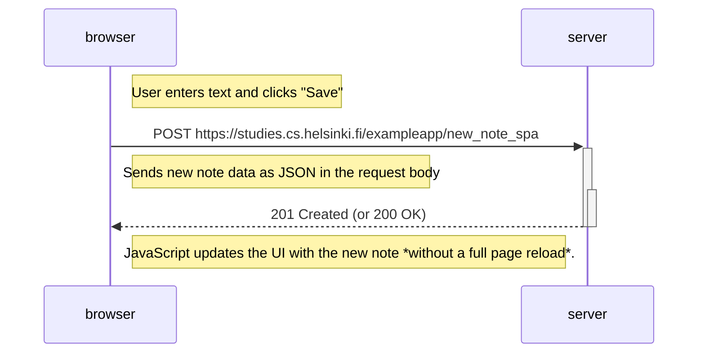

```mermaid
sequenceDiagram
    participant browser
    participant server

    Note right of browser: User enters text and clicks "Save"

    browser->>+server: POST https://studies.cs.helsinki.fi/exampleapp/new_note_spa
    Note right of browser: Sends new note data as JSON in the request body
    activate server
    server-->>-browser: 201 Created (or 200 OK)
    deactivate server

    Note right of browser: JavaScript updates the UI with the new note *without a full page reload*.
```
